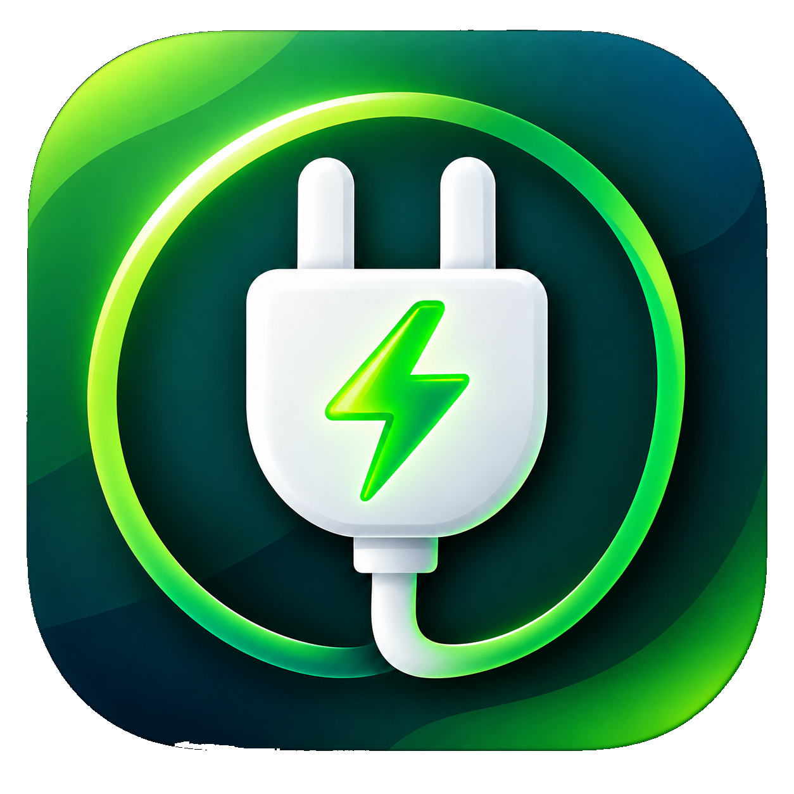
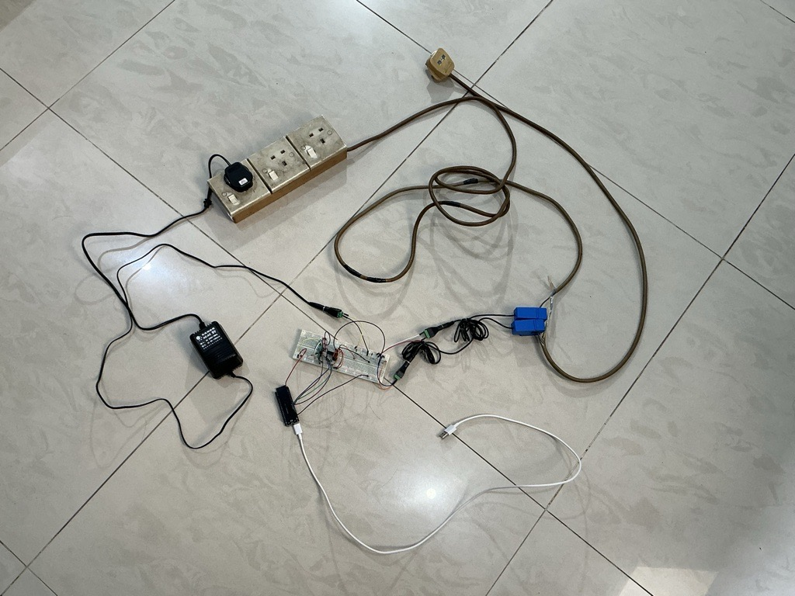
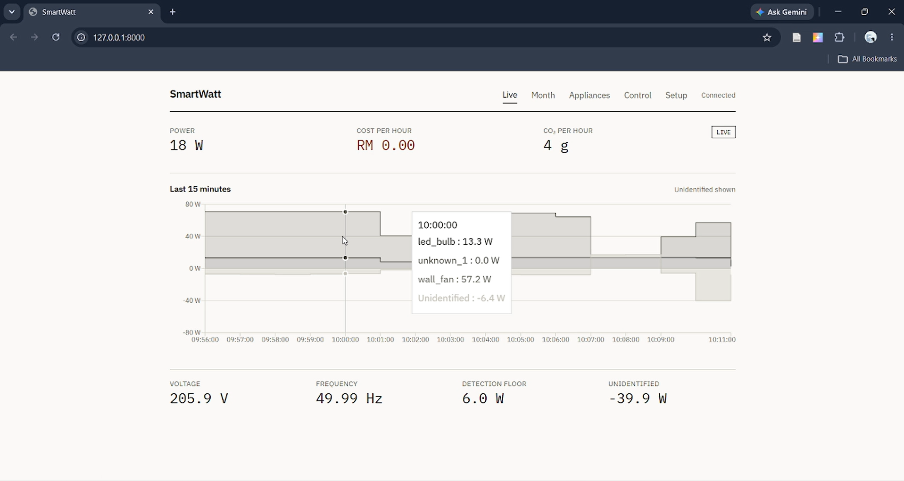
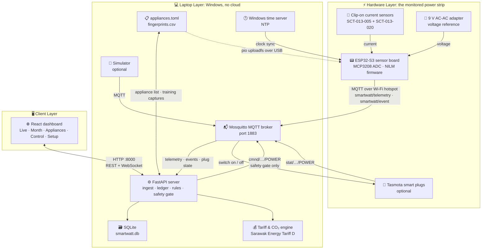
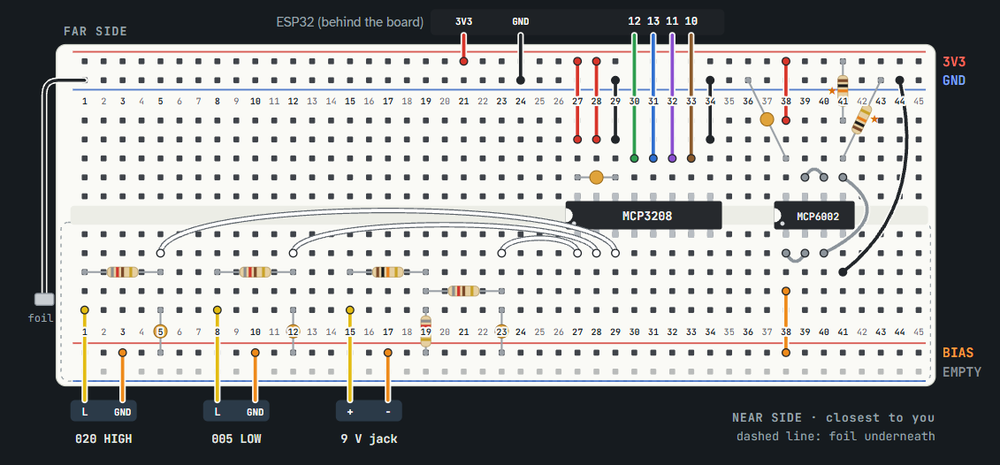
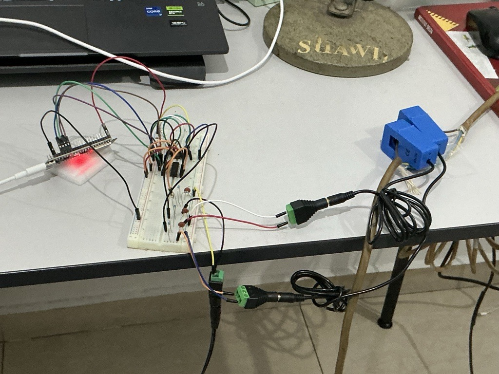
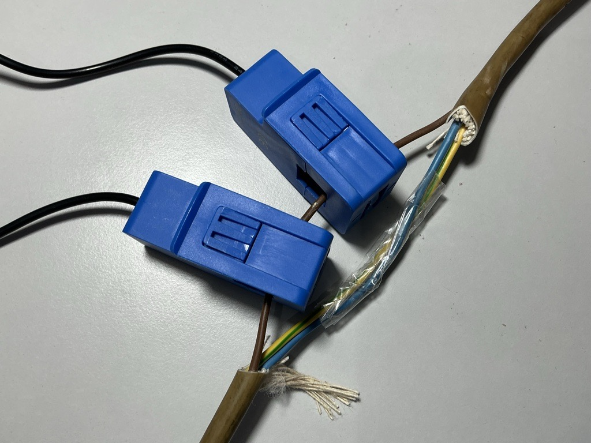

<div align="center">
    
    <h1>SmartWatt</h1>
    <h3><em>See which appliance is using your electricity, what it costs you, and switch it off automatically. All of it from one clip-on sensor</em></h3>
</div>

<p align="center">
  
  
  
  
  
</p>

<p align="center">
  
  
  
  
  
  
  
  
</p>

---

# What is SmartWatt?

SmartWatt is a small do-it-yourself energy monitor. You clip a sensor around **one wire** (you never cut or open anything), and SmartWatt works out **which appliance just switched on**: the kettle, the fan, the lamp. It does this from the appliance's electrical "fingerprint". It then shows you:

- **how much power** each appliance is using right now;
- **what it costs** on your electricity bill. SmartWatt understands Sarawak Energy's *Tariff D*, where using a little more in a month can move the **whole month** into a more expensive price band. SmartWatt warns you before you cross that line;
- **how much CO₂** your usage is responsible for;
- and, if you add **smart plugs**, it can **switch appliances off for you** when they are left on. It always warns you first and gives you 60 seconds to cancel. It never touches anything you mark as protected, and it never switches on anything that heats up.

Everything runs on **your own laptop**. There is no cloud, no account and no subscription.

<p align="center">
  
</p>

<p align="center">
  
</p>

> **Status: prototype.** SmartWatt is a working research prototype, and its software is covered by automated tests. How accurate it is on your appliances depends on how carefully you build and calibrate your sensor board (Part 5 shows how). No accuracy figures are claimed here.

---

# 🏗️ System Architecture



---

## Contents

- [How it works (in plain words)](#how-it-works-in-plain-words)
- [Safety first: read this before anything else](#safety-first-read-this-before-anything-else)
- [What you need](#what-you-need)
  - [Hardware shopping list](#hardware-shopping-list)
  - [Software (all free)](#software-all-free)
- [Part 1: Try SmartWatt on your laptop, no hardware needed](#part-1-try-smartwatt-on-your-laptop-no-hardware-needed)
- [Part 2: Build the sensor board](#part-2-build-the-sensor-board)
- [Part 3: Prepare your laptop (one time only)](#part-3-prepare-your-laptop-one-time-only)
- [Part 4: Put SmartWatt onto the ESP32 board](#part-4-put-smartwatt-onto-the-esp32-board)
- [Part 5: First power-up and calibration](#part-5-first-power-up-and-calibration)
- [Part 6: Set up smart plugs (optional)](#part-6-set-up-smart-plugs-optional)
- [Part 7: Tell SmartWatt about YOUR appliances](#part-7-tell-smartwatt-about-your-appliances)
- [Part 8: Train SmartWatt to recognise your appliances](#part-8-train-smartwatt-to-recognise-your-appliances)
- [Part 9: Everyday use](#part-9-everyday-use)
- [Troubleshooting](#troubleshooting)
- [Using SmartWatt outside Sarawak](#using-smartwatt-outside-sarawak)
- [For developers](#for-developers)

---

## How it works (in plain words)

```
  Wall socket ── safety switch (RCD) ── line splitter ── power strip ── your appliances
                                             │
                          two clip-on current sensors, around ONE wire
                                             │
  9 V AC adapter (senses the voltage) ──►  SENSOR BOARD  (breadboard + ESP32-S3)
                                             │
                                          Wi-Fi
                                             ▼
                                        YOUR LAPTOP
                        ├── Mosquitto: a "post office" for the messages
                        ├── SmartWatt server: saves the data, works out the bill
                        ├── the dashboard: a web page you open in your browser
                        └── smart plugs (optional) ◄── SmartWatt switches them
```

1. **Measuring.** The sensor board measures the voltage and the current 4,000 times a second.
2. **Noticing a change.** When the total power suddenly jumps up or down, something was switched on or off.
3. **Recognising it.** SmartWatt compares the jump's electrical fingerprint (14 measurements, such as how much power, how "spiky" the current is, and how big the start-up surge is) with fingerprints you taught it in [Part 8](#part-8-train-smartwatt-to-recognise-your-appliances). If nothing matches well enough, it honestly says **"unknown"** instead of guessing.
4. **Reporting.** The board sends everything over Wi-Fi to your laptop, which stores it and shows it on the dashboard.

SmartWatt monitors **everything plugged into one power strip**. It does not monitor your whole house: that would mean clipping the sensor inside your fuse box, which only a licensed electrician may open.

---

## Safety first: read this before anything else

⚠️ Mains electricity (240 V) **can kill you**. SmartWatt is designed so that **you never touch, cut or open anything connected to mains**. Keep it that way.

- **Nothing on your breadboard ever connects to mains.** Its only inputs are the low-voltage output of a 9 V AC adapter and the tiny signals from the clip-on sensors.
- **Never cut, strip or open** a cable, plug, socket or fuse box. The clip-on sensor goes around one wire of a **line splitter** (a ready-made product, see the shopping list). Never make your own by cutting an extension cable.
- **Only use the SCT-013-005 and SCT-013-020 current sensors** (or the -010 / -030 substitutes). **Never use the SCT-013-000.** It has no built-in protection resistor, and it can produce dangerous voltages when unplugged while clipped on.
- **Use an RCD** (a portable safety switch, 30 mA) between the wall and everything else. Press its **TEST** button at the start of every session: it must switch off. Then reset it.
- **Power the ESP32 board only from your laptop's USB port.**
- **Heating appliances** (kettle, iron, heater): never leave them unattended while testing. Keep water and fire away from the electronics, and keep a fire extinguisher (ABC powder type) nearby.
- If anything gets hot, smells or smokes: **switch off at the wall first**, then investigate.

You build and use this project at your own risk. If you are unsure about any step, ask someone qualified.

---

## What you need

### Hardware shopping list

Everything below is for **one** SmartWatt. Search for the part names on Shopee or Lazada (Malaysia), or any electronics shop. Buy one or two spares of the three chips (items 1-3). They are cheap, and a spare saves a week of waiting if one gets damaged.

#### The sensor board

| # | Item | Qty | What it's for | ⚠️ Watch out |
|---|---|---|---|---|
| 1 | **ESP32-S3-DevKitC-1 N16R8** | 1 | The small computer that runs SmartWatt | Must be the **N16R8** version (16 MB flash, 8 MB PSRAM). Other versions will not work with the settings in this project |
| 2 | **MCP3208** 12-bit ADC, **DIP-16** (`MCP3208-CI/P`) | 1 | Turns the sensor signals into numbers | Get the **DIP** (through-hole) package, not SOIC/SMD |
| 3 | **MCP6002** op-amp, **DIP-8** (`MCP6002-I/P`) | 1 | Makes a steady 1.65 V "middle" reference | Get the **DIP** package, not "I/SN" (SMD) |
| 4 | **SCT-013-005** clip-on current sensor (5 A : 1 V) | 1 | Measures small loads precisely | **Never the SCT-013-000.** Many listings are titled "SCT-013-000" and let you pick other ratings in a menu. Make sure you are buying **005** ("5A 1V") |
| 5 | **SCT-013-020** clip-on current sensor (20 A : 1 V) | 1 | Measures big loads such as a kettle | Same warning. The only allowed substitute is the **SCT-013-030** |
| 6 | **9 V AC-AC adapter** (a plug-in transformer) | 1 | Lets the board sense the mains voltage safely | Its label must say **AC output** ("9V~", "9VAC", "AC-AC"). Most "9 V adapters" are **AC-DC** and **will not work**. Part 2 shows how to check |
| 7 | 10 kΩ resistor (¼ W) | 3 | | Buy a resistor assortment kit: it has all values |
| 8 | 820 Ω resistor (¼ W) | 4 | | |
| 9 | 100 nF ceramic capacitor (marked "104") | 5 | | |
| 10 | 3.5 mm audio jack to **screw terminal** breakout board | 2 | Connects each current sensor's plug to the breadboard | Look for a small board with screw terminals, not a cable adapter |
| 11 | DC barrel jack (female) to **screw terminal** adapter | 1 | Connects the AC adapter's plug to the breadboard | Must fit your adapter's plug (usually 5.5 × 2.1 mm) |
| 12 | Solderless breadboard, 830 points | 1 | Where the circuit is built. **No soldering needed** | |
| 13 | Jumper wire kit (male-male, male-female, female-female) | 1 | The wires | |
| 14 | USB-C **data** cable | 1 | Connects the ESP32 to your laptop | Some cheap cables only charge. It must carry **data** |
| 15 | Kitchen aluminium foil | a little | Optional shield under the breadboard, which lowers noise | |

#### Safety and mains side

| # | Item | Qty | What it's for |
|---|---|---|---|
| 16 | **Portable RCD** plug adapter, 30 mA (SIRIM approved) | 1 | Cuts the power in milliseconds if current leaks to earth |
| 17 | **AC line splitter** with a UK/Malaysian (BS 1363) plug | 1 | Separates the live wire into a loop you can clip the sensors around, safely. **Use the ×1 loop, not the ×10 loop** |
| 18 | Power strip (extension socket) | 1 | Everything plugged in here is what SmartWatt monitors |
| 19 | Multimeter (with AC volts, DC volts and continuity/beep) | 1 | Checks your parts and wiring |
| 20 | **Plug-in energy meter** (shows volts, amps and watts) | 1 | Your reference for calibration in Part 5. Safest option: no probes near mains |
| 21 | Fire extinguisher, ABC powder type | 1 | For work with heating appliances |

#### Optional

| # | Item | Qty | What it's for |
|---|---|---|---|
| 22 | **Tasmota** smart plug with energy monitoring (Type G / UK plug, pre-flashed with Tasmota) | 1 or more | Lets SmartWatt switch appliances on and off. Must run **Tasmota** firmware. Plugs sold for other phone apps (Tuya, Smart Life) will not work unless you re-flash them |
| 23 | Clamp meter | 1 | A more precise calibration reference than the energy meter |

#### You also need

- A **Windows 10 or 11 laptop** with Wi-Fi and a USB port. This guide is written for Windows.
- **Your appliances.** SmartWatt learns *your* appliances. It notices changes of about **8 W or more**, so very small loads (a phone charger with nothing charging, say) are below what it can see.

The original prototype was budgeted at about **RM 700** (Malaysia, 2026), including two smart plugs and spare chips. Prices change, so treat that as a rough guide.

### Software (all free)

You install these in Part 1 and Part 4. Each has an installer, and nothing needs programming knowledge.

| Software | What it does |
|---|---|
| **uv** | Installs Python and everything SmartWatt's server needs |
| **Node.js** | Builds the dashboard web page |
| **Mosquitto** | The "post office" that carries messages between the board and the laptop |
| **PlatformIO** | Uploads SmartWatt onto the ESP32 board (Part 4) |

---

## Part 1: Try SmartWatt on your laptop, no hardware needed

SmartWatt comes with a **simulator** that pretends to be the sensor board. Getting this working first shows your laptop is set up correctly, before you touch any hardware. It takes about 30 minutes.

### Step 1.1: Learn to open PowerShell

PowerShell is a window where you type commands. You will use it a lot. Whenever this guide shows a grey box like this:

```powershell
uv --version
```

**click in the PowerShell window, type the command exactly (or copy it and right-click to paste), and press Enter.**

To open PowerShell: press the **Windows key**, type `powershell`, and click **Windows PowerShell**.

### Step 1.2: Install uv

In PowerShell, copy and paste this line, then press Enter:

```powershell
powershell -ExecutionPolicy ByPass -c "irm https://astral.sh/uv/install.ps1 | iex"
```

When it finishes, **close PowerShell and open it again** (new programs are only found in a new window). Check that it worked:

```powershell
uv --version
```

You should see something like `uv 0.8.23`. If you see *"uv is not recognized"*, close PowerShell and open it again.

### Step 1.3: Install Node.js

1. Go to **https://nodejs.org** and download the version marked **LTS**.
2. Run the installer and click **Next** through every page (the defaults are fine).
3. Close PowerShell and open it again, then check:

```powershell
node --version
```

### Step 1.4: Install Mosquitto

1. Go to **https://mosquitto.org/download/** and download the Windows **64-bit** installer (`mosquitto-…-install-windows-x64.exe`).
2. Run it. On the **Choose Components** page, **untick "Service"**. SmartWatt starts Mosquitto itself, with its own settings, and the service would get in the way.
3. Keep the install folder as `C:\Program Files\mosquitto`. SmartWatt looks for it there.

### Step 1.5: Download SmartWatt

**Easy way:** at the top of this GitHub page, click the green **Code** button, then **Download ZIP**. Open your Downloads folder, right-click the ZIP file, choose **Extract All…**, and extract it to somewhere simple such as `Documents`.

**If you know Git:** `git clone` the repository instead.

You now have a **SmartWatt folder** containing `README.md`, `appliances.toml`, and folders such as `firmware` and `server`.

### Step 1.6: Open PowerShell *inside* the SmartWatt folder

Almost every command in this guide must run **inside the SmartWatt folder**.

1. Open the SmartWatt folder in File Explorer (the one containing `README.md`).
2. Click once on the **address bar** at the top (where the folder path is shown). It turns into editable text.
3. Type `powershell` and press **Enter**.

A PowerShell window opens *in that folder*: the line before the cursor ends with your SmartWatt folder's path. Do this whenever the guide says **"open PowerShell in the SmartWatt folder"**.

### Step 1.7: Install SmartWatt's parts

In PowerShell in the SmartWatt folder, run these one at a time. Each can take a few minutes the first time.

```powershell
uv sync --all-packages
```

This downloads Python and every library SmartWatt's server uses. Type it exactly: `--all-packages` matters.

```powershell
cd dashboard
npm install
npm run build
cd ..
```

This builds the dashboard web page. `cd dashboard` goes into the `dashboard` folder, and `cd ..` comes back out. A yellow warning about *"chunks larger than 500 kB"* is normal.

### Step 1.8: Start SmartWatt

SmartWatt needs **two windows running at the same time**. Each keeps running until you close it, so **open a new PowerShell in the SmartWatt folder for each** (repeat Step 1.6).

**Window 1: the post office (Mosquitto):**

```powershell
powershell -ExecutionPolicy Bypass -File tools\run-broker.ps1
```

It prints a few lines and then waits. Leave it open.

**Window 2: the SmartWatt server:**

```powershell
powershell -ExecutionPolicy Bypass -File tools\run-server.ps1
```

Wait until you see `Application startup complete`. If Windows asks whether to **allow Python on networks**, tick **Private networks** and click **Allow**. Leave it open.

> **Why the long command?** Windows blocks script files by default. `-ExecutionPolicy Bypass` lets this one script run, without changing any setting on your computer.

### Step 1.9: Run the simulator and open the dashboard

**Window 3: the simulator:**

```powershell
uv run sim publish --scenario demo --now
```

Now open your web browser (Chrome, Edge, Firefox…) and go to:

**http://127.0.0.1:8000**

You should see the **Live** screen come alive: power, cost, CO₂ and a chart, with a **SIMULATED** badge in the corner. The demo pretends to switch appliances on and off for about two minutes. Click through the **Month**, **Appliances** and **Control** screens too.

🎉 **If you see this, your laptop is ready.**

To stop everything, click each PowerShell window and press **Ctrl + C**, or just close the windows.

> **Tip:** "Cost per hour" can read **RM 0.00** early in the month. That is correct, not a bug: while your month's usage is still under Sarawak Energy's minimum charge, using a bit more doesn't change your bill.

---

## Part 2: Build the sensor board

Take your time here. Most problems later come from one wrong wire. **Do all of Part 2 with nothing plugged into the wall.**

### Step 2.1: Check your parts

1. **The AC adapter must output AC.** This is the most common mistake: an AC-DC adapter looks identical and fails silently.
   - Plug the adapter into the wall, with nothing connected to its output. Attach the barrel-jack screw-terminal adapter (item 11) to its plug.
   - Set your multimeter to **V~ (AC volts)** and touch the probes to the two screw terminals. You should read **9 to 13 V**. It reads higher than 9 because nothing is connected.
   - Switch the multimeter to **V⎓ (DC volts)**. You should read **almost 0 V** (below 0.5 V).
   - **If DC reads high and AC reads near zero, you have an AC-DC adapter. Stop and get the right one.**
   - Unplug the adapter again.
2. **Read the labels.** The current sensors must say **SCT-013-005** and **SCT-013-020** (never 000). The chips must say **MCP3208** and **MCP6002**.
3. **Match two 10 kΩ resistors.** Set your multimeter to resistance (Ω) and measure all your 10 kΩ resistors. Pick the **two closest to each other** (ideally within 10 Ω). They form the 1.65 V middle reference, and a mismatch shifts every measurement. Use a third one for the voltage channel.

### Step 2.2: Know your chips' legs

Push each chip into the breadboard so it **straddles the centre gap**, with its **notch (or dot) pointing left**. Pin 1 is then the **bottom-left** leg. Pins count left to right along the bottom row, then right to left along the top row:

**MCP3208 (16 legs)**

.png)

**MCP6002 (8 legs)**

.png)

### Step 2.3: Plan your breadboard rails

A breadboard has long **rails** along its top and bottom edges. In this build:

| Rail | Use it for | Tip |
|---|---|---|
| Top red **+** rail | **3V3**: 3.3 V power | |
| Top blue **−** rail | **GND**: ground | |
| Bottom red **+** rail | **BIAS**: the 1.65 V middle reference | Put a piece of tape on it and write "BIAS" |

If your rails have a break in the middle (a gap in the red/blue line), bridge each one with a short wire.

The ESP32 board stays **off** the breadboard. Connect it with **female-to-male jumper wires**. Its pins are labelled on the board (`3V3`, `GND`, `10`, `11`, `12`, `13` …).

### Step 2.4: Wire it up



Make each connection below and tick it off. "→" means "one wire (or one component) from … to …".

**Power**

| ✔ | Connect | → | To |
|---|---|---|---|
| ☐ | ESP32 pin **3V3** | → | top **3V3** rail |
| ☐ | ESP32 pin **GND** | → | top **GND** rail |

**The 1.65 V middle reference ("BIAS"): MCP6002**

| ✔ | Connect | → | To |
|---|---|---|---|
| ☐ | MCP6002 pin **8** (VDD) | → | 3V3 rail |
| ☐ | MCP6002 pin **4** (VSS) | → | GND rail |
| ☐ | a **100 nF** capacitor | between | MCP6002 pin 8 and pin 4 (keep it right next to the chip) |
| ☐ | a matched **10 kΩ** | → | from the 3V3 rail to an empty column. Call that column **DIV** |
| ☐ | the other matched **10 kΩ** | → | from **DIV** to the GND rail |
| ☐ | MCP6002 pin **3** (IN+ A) | → | **DIV** |
| ☐ | MCP6002 pin **2** (IN− A) | → | MCP6002 pin **1** (OUT A) |
| ☐ | MCP6002 pin **1** (OUT A) | → | the **BIAS** rail |
| ☐ | MCP6002 pin **5** (IN+ B) | → | **DIV** (this ties off the unused half of the chip) |
| ☐ | MCP6002 pin **6** (IN− B) | → | MCP6002 pin **7** (OUT B) |

**The ADC: MCP3208**

| ✔ | Connect | → | To |
|---|---|---|---|
| ☐ | MCP3208 pin **16** (VDD) **and** pin **15** (VREF) | → | 3V3 rail |
| ☐ | MCP3208 pin **14** (AGND) **and** pin **9** (DGND) | → | GND rail |
| ☐ | a **100 nF** capacitor | between | MCP3208 pin 16 and pin 14 (right next to the chip) |
| ☐ | MCP3208 pin **13** (CLK) | → | ESP32 pin **12** |
| ☐ | MCP3208 pin **12** (DOUT) | → | ESP32 pin **13** |
| ☐ | MCP3208 pin **11** (DIN) | → | ESP32 pin **11** |
| ☐ | MCP3208 pin **10** (CS) | → | ESP32 pin **10** |

**Voltage input: the AC adapter → MCP3208 channel 0.** Your barrel-jack adapter has two screw terminals. Call them **A** and **B** (either way round is fine, and Part 5 tells you if they need swapping).

| ✔ | Connect | → | To |
|---|---|---|---|
| ☐ | terminal **A** | → | a **10 kΩ** resistor → an empty column. Call it **VD** |
| ☐ | **VD** | → | an **820 Ω** resistor → the **BIAS** rail |
| ☐ | **VD** | → | an **820 Ω** resistor → an empty column. Call it **N0** |
| ☐ | **N0** | → | a **100 nF** capacitor → the **BIAS** rail |
| ☐ | **N0** | → | MCP3208 pin **1** (CH0) |
| ☐ | terminal **B** | → | the **BIAS** rail |

**Current input, small loads: SCT-013-005 → channel 1.** Plug the sensor into a 3.5 mm breakout board. Use its **tip** (T) and **sleeve** (S) terminals, and leave the ring (R) unused.

| ✔ | Connect | → | To |
|---|---|---|---|
| ☐ | **sleeve** | → | the **BIAS** rail |
| ☐ | **tip** | → | an **820 Ω** resistor → an empty column. Call it **N1** |
| ☐ | **N1** | → | a **100 nF** capacitor → the **BIAS** rail |
| ☐ | **N1** | → | MCP3208 pin **2** (CH1) |

**Current input, big loads: SCT-013-020 → channel 2.** Same again, with the second breakout board:

| ✔ | Connect | → | To |
|---|---|---|---|
| ☐ | **sleeve** | → | the **BIAS** rail |
| ☐ | **tip** | → | an **820 Ω** resistor → an empty column. Call it **N2** |
| ☐ | **N2** | → | a **100 nF** capacitor → the **BIAS** rail |
| ☐ | **N2** | → | MCP3208 pin **3** (CH2) |



**Clamp the SCT-013-020 and SCT-013-005 onto the Live Wire of Extension Socket**



**Two things people get wrong:**

- The sensors' **sleeves**, adapter terminal **B**, and the three **filter capacitors** on N0, N1 and N2 all go to **BIAS, not GND**. That is what lets the board measure both halves of the AC wave.
- **Never** put a capacitor directly between BIAS and GND. It can make the reference unstable.

You should have used exactly **3 × 10 kΩ, 4 × 820 Ω and 5 × 100 nF**. MCP3208 pins 4 to 8 stay empty.

**Optional, lowers noise:** keep the wires to the chips short, keep the sensor wires away from the USB cable, and tape a sheet of kitchen foil **under** the breadboard (the breadboard's backing must be intact, so the foil can't touch any metal clip), connected with one wire to the GND rail.

### Step 2.5: Check before powering

With **nothing** plugged in (no USB, no adapter, no sensors), set your multimeter to **continuity** (it beeps when two points are connected):

- 3V3 rail to GND rail: **no beep** (a beep means a short. Find it before continuing).
- BIAS rail to GND rail: **no beep**. BIAS rail to 3V3 rail: **no beep**.
- Each of N0, N1 and N2 beeps to its MCP3208 pin (1, 2, 3) and to **nothing else**.

Then plug **only** the USB cable (laptop ↔ ESP32, into the port labelled **UART** or **COM**). Set the multimeter to **DC volts** and measure against the GND rail:

- 3V3 rail: about **3.3 V**.
- BIAS rail: **half of the 3V3 reading**. For example 1.650 V if 3V3 reads 3.300 V. It should be within about **±0.005 V** of exactly half. If it's further off, swap in a better-matched pair of 10 kΩ resistors.

Unplug the USB again. Well done: the hard part is over.

---

## Part 3: Prepare your laptop (one time only)

The sensor board talks to your laptop over the laptop's own **Wi-Fi hotspot**, and gets the **time** from the laptop. The board refuses to send anything until it knows the correct time, so this part matters.

### Step 3.1: Run the setup commands as administrator

1. Press the **Windows key**, type `powershell`, then **right-click Windows PowerShell** and choose **Run as administrator**. Click **Yes**.
2. Copy and paste this whole block and press Enter:

```powershell
# Stop Windows' own Mosquitto service, if it was installed, so it doesn't block SmartWatt's
Stop-Service mosquitto -ErrorAction SilentlyContinue; Set-Service mosquitto -StartupType Disabled -ErrorAction SilentlyContinue

# Turn the laptop into a time server for the sensor board
Set-ItemProperty "HKLM:\SYSTEM\CurrentControlSet\Services\W32Time\TimeProviders\NtpServer" -Name Enabled -Value 1
Set-ItemProperty "HKLM:\SYSTEM\CurrentControlSet\Services\W32Time\Config" -Name AnnounceFlags -Value 5
Set-Service w32time -StartupType Automatic; Restart-Service w32time

# Let the sensor board and smart plugs through the firewall
New-NetFirewallRule -DisplayName "SmartWatt MQTT" -Direction Inbound -Protocol TCP -LocalPort 1883 -Action Allow
New-NetFirewallRule -DisplayName "SmartWatt time" -Direction Inbound -Protocol UDP -LocalPort 123 -Action Allow
```

3. Close the administrator window. You never need to do this again.

### Step 3.2: Set up the Wi-Fi hotspot

1. Open **Settings → Network & internet → Mobile hotspot**.
2. Click **Edit** (or **Properties**) and set:
   - **Network name**: anything, e.g. `SmartWatt-Hotspot`. **Write it down.**
   - **Network password**: at least 8 characters. **Write it down.**
   - **Network band**: **2.4 GHz**. The ESP32 cannot see 5 GHz networks.
   - Click **Save**.
3. Turn **Power saving** **off** (if your Windows shows it). Otherwise Windows switches the hotspot off when nothing is connected.
4. Switch **Mobile hotspot** **on**.

Windows only allows a hotspot while the laptop itself has an internet connection (Wi-Fi or cable), so stay connected to your home network.

Your laptop's address on its own hotspot is always **192.168.137.1**, and SmartWatt is already set up for that.

---

## Part 4: Put SmartWatt onto the ESP32 board

### Step 4.1: Install PlatformIO

In PowerShell (anywhere):

```powershell
uv tool install platformio
```

Close PowerShell, open it again, and check:

```powershell
pio --version
```

### Step 4.2: Enter your hotspot's name and password

1. Open PowerShell in the SmartWatt folder and run:

   ```powershell
   notepad firmware\src\main.cpp
   ```

2. In Notepad press **Ctrl + F**, type `CHANGE ME`, and press Enter. You will find:

   ```cpp
   "YOUR_HOTSPOT_NAME",      // CHANGE ME: the hotspot's network name
   "YOUR_HOTSPOT_PASSWORD",  // CHANGE ME: the hotspot's network password
   ```

3. Replace `YOUR_HOTSPOT_NAME` and `YOUR_HOTSPOT_PASSWORD` with the name and password from Step 3.2. **Keep the quote marks and the comma.** For example:

   ```cpp
   "SmartWatt-Hotspot",      // CHANGE ME: the hotspot's network name
   "my-secret-pass",         // CHANGE ME: the hotspot's network password
   ```

4. Save (**Ctrl + S**) and close Notepad. Don't change anything else in the file.

> If you ever share your copy of SmartWatt online, put the placeholders back first. Your password is in this file.

### Step 4.3: Connect the board

1. Plug the USB cable into the ESP32's port labelled **UART** (or **COM**), **not** the one labelled **USB**, and into your laptop.
2. Open **Device Manager** (right-click the Start button → Device Manager) and expand **Ports (COM & LPT)**. You should see something like *"Silicon Labs CP210x … (COM3)"* or *"USB-SERIAL CH340 (COM5)"*.
   - **Nothing there?** Try another cable (it may be charge-only). Otherwise install the driver for the USB chip printed near the UART port: search for **"CP210x driver"** (Silicon Labs) or **"CH340 driver"** (WCH).

### Step 4.4: Upload

In PowerShell in the SmartWatt folder:

```powershell
cd firmware
pio run -e esp32-s3 -t upload
```

The **first time**, PlatformIO downloads its tools for the ESP32. That can take **10-20 minutes**. It ends with `[SUCCESS]`.

If it says **"Failed to connect"**: hold down the **BOOT** button on the board, press and release **RST**, release **BOOT**, and run the command again.

### Step 4.5: Watch what the board says

Still in the `firmware` folder:

```powershell
pio device monitor -e esp32-s3 --echo
```

This window shows the board's messages. You should see:

```
SmartWatt bring-up
Calibration: none stored in NVS -- using compile-time defaults, ...
Fingerprints: no usable table on LittleFS -- events will classify as unknown_N only
Clock: UNSET at boot ...
```

Once it has joined the hotspot and reached the laptop's broker (which must be running: Step 1.8, Window 1), it says:

```
Broker connected: ...
```

That's all for now. Measurements only start in Part 5, once the AC adapter is connected, because the board measures in step with the mains voltage. To leave the monitor, press **Ctrl + C**. To go back to the SmartWatt folder, type `cd ..`.

> Only one program can use the board's USB connection at a time. **Close the monitor (Ctrl + C) before uploading.**

---

## Part 5: First power-up and calibration

Calibration teaches SmartWatt the exact behaviour of **your** adapter and sensors, so that its volts, amps and watts are right. **Calibrate before you train (Part 8).** If you re-calibrate later, you have to train again.

### Step 5.1: Set up the monitored power strip

Connect, in this order: **wall socket → RCD → plug-in energy meter → line splitter → power strip**.

1. Press the RCD's **TEST** button: it must switch off. Reset it.
2. Clip **both** current sensors around the line splitter's **×1** loop, **facing the same way**. Leave the ×10 loop empty.
3. Plug the sensors' 3.5 mm plugs into their breakout boards (005 → channel 1 board, 020 → channel 2 board).
4. Plug the **AC adapter** into an ordinary wall socket and connect its barrel plug to the breakout (terminals A/B).
5. Plug the ESP32 into the laptop's USB.

### Step 5.2: Start SmartWatt and open the monitor

Start Window 1 (broker) and Window 2 (server) as in Step 1.8. **Don't run the simulator** now: the real board is the data source. Then, in a PowerShell in the SmartWatt folder:

```powershell
cd firmware
pio device monitor -e esp32-s3 --echo
```

Now a status line appears **every second**:

```
Vrms= 283.41  Irms= 0.0123  P=   1.02  Q1=  0.31  D=  0.20  PF=0.100  f=50.004  range=low  overruns=0  worst=40us  vclip=0
```

- **`vclip` must stay 0.** If it keeps rising, the voltage signal is too big. Re-check the voltage wiring (10 kΩ / 820 Ω).
- The numbers aren't correct yet (Vrms may be far from 240). That's what calibration fixes.
- Open **http://127.0.0.1:8000**: the Live screen should now show data with a **LIVE** badge. If the monitor instead repeats `WITHHOLDING PUBLISH: clock NOT set`, the board can't get the time from the laptop (see [Troubleshooting](#troubleshooting)).

### Step 5.3: Check the direction (polarity)

Plug a **heater, kettle or ordinary incandescent lamp** into the power strip and switch it on. **P must be positive.**

- **Negative P on both small and big loads:** unplug the AC adapter from the wall, **swap the wires on terminals A and B**, and plug it back.
- **Negative only on big loads (`range=high`) or only on small ones (`range=low`):** turn the matching current sensor around on the wire.

### Step 5.4: Set the starting values

Type this into the monitor window and press Enter:

```
CAL 0.2835 0.0040283 0.016113 0
```

It replies `CAL: stored in NVS and applied`. These are the calculated starting values for this circuit. Now you refine them against your plug-in energy meter.

### Step 5.5: Measure and correct

For each step below you **average 30 seconds** of readings:

1. Set up the load described in the table.
2. Start a logging monitor (inside the `firmware` folder):

   ```powershell
   pio device monitor -e esp32-s3 --echo -f log2file
   ```

3. Wait **30 seconds** without touching anything, and note what your **energy meter** shows (volts, amps).
4. Press **Ctrl + C**, then run these two lines to average what was logged:

   ```powershell
   $log = (Get-ChildItem logs\device-monitor-*.log | Sort-Object LastWriteTime)[-1].FullName
   uv run python tools\serial_stats.py $log --skip 5
   ```

   It prints the average of each reading, e.g. `Vrms: mean 283.4100`, plus a `phi1 = ...` line.

Work out the new values like this (**"meter"** = your energy meter, **"board"** = the mean from `serial_stats`):

| What | Load on the strip | New value |
|---|---|---|
| **v_cal** (voltage) | anything, even nothing | 0.2835 × meter volts ÷ board **Vrms** |
| **i_cal_low** (small loads) | a steady load of about 100-1000 W, e.g. an incandescent lamp or a small heater. The status line must say `range=low` | 0.0040283 × meter amps ÷ board **Irms** |
| **i_cal_high** (big loads) | a **kettle** with water in it (stay with it, switch it off after ~30 s). The status line must say `range=high` | 0.016113 × meter amps ÷ board **Irms** |

Send all three in one line (the last number stays 0 for now), for example:

```
CAL 0.2217 0.0041050 0.016400 0
```

### Step 5.6: Correct the timing error (phase)

With the new values stored, put a **purely resistive** load on the strip (an **incandescent lamp** or a **heater**, not a fan and not anything with a charger), log 30 seconds again, and run `serial_stats` again. Copy the number after **`phi1 =`** (in radians, e.g. `+0.048712`) as the last value:

```
CAL 0.2217 0.0041050 0.016400 0.048712
```

(If you repeat this step later, the new last value is the **old one plus** the new `phi1`.)

### Step 5.7: Confirm

- Type `CAL?` and press Enter. It prints the values in use and says **from NVS** (stored on the board).
- Unplug the USB and plug it back. The first lines must say **`Calibration: loaded from NVS`** with your values.
- With the lamp on, the board's **Vrms**, **Irms** and **P** should now agree closely with your energy meter.

**Calibration is done. Don't change it again unless you change the hardware.** If you do, re-train (Part 8).

---

## Part 6: Set up smart plugs (optional)

Skip this part if you don't have Tasmota smart plugs. SmartWatt still recognises, measures and costs everything. It just can't switch things for you.

For **each** plug:

1. Plug it into a wall socket (nothing plugged into it).
2. On your phone or laptop, join the Wi-Fi network the plug creates (named like `tasmota-XXXXXX`), then open **http://192.168.4.1** in a browser.
3. Enter your **hotspot's** name and password (Step 3.2) and save. The plug restarts and joins the hotspot.
4. Find the plug's new address: in **Settings → Network & internet → Mobile hotspot**, it is listed under connected devices (e.g. `192.168.137.123`). Open that address in your laptop's browser.
5. Go to **Configuration → Configure MQTT** and set:
   - **Host**: `192.168.137.1`
   - **Port**: `1883`
   - **Topic**: a short name for this plug, e.g. `plug_fan`. Use only letters, digits and `_`. **Write it down:** it goes into `appliances.toml` in Part 7.
   - Save.
6. Go to **Tools → Console** and type these, pressing Enter after each:
   ```
   PowerOnState 0
   TelePeriod 10
   Timezone 8
   ```
   (`PowerOnState 0` keeps the plug **off** after a power cut, which is important for heaters. `Timezone 8` is Malaysia's time zone.)

**Test it.** With the broker running (Window 1), in a PowerShell window:

```powershell
& "C:\Program Files\mosquitto\mosquitto_pub.exe" -h 127.0.0.1 -t cmnd/plug_fan/POWER -m ON
& "C:\Program Files\mosquitto\mosquitto_pub.exe" -h 127.0.0.1 -t cmnd/plug_fan/POWER -m OFF
```

(Replace `plug_fan` with your Topic.) The plug should click on, then off.

---

## Part 7: Tell SmartWatt about YOUR appliances

All your appliances are listed in **one file: `appliances.toml`**, in the SmartWatt folder. It comes with five **example** appliances (kettle, desk fan, incandescent lamp, LED bulb, laptop charger). **Replace them with your own.**

Open it:

```powershell
notepad appliances.toml
```

Each appliance is one block like this:

```toml
[[appliance]]
id = "rice_cooker"
name = "Rice cooker"
plug = "plug_rice"
protected = false
heating = true
train = true
left_on_rule = false
standby_rule = false
```

| Line | Meaning |
|---|---|
| `id` | A short code name: lowercase letters, digits and `_`, starting with a letter, up to 23 characters, **no spaces**. **Choose it once and don't change it later**: your training data is saved under this name |
| `name` | What the dashboard shows. Anything you like |
| `plug` | The smart plug's **Topic** from Part 6, or `""` if it isn't on a smart plug. One plug per appliance |
| `protected` | `true` = SmartWatt will **never** switch it off, not even if you press the button. Use it for the fridge, router, medical equipment… |
| `heating` | `true` = SmartWatt may switch it **off** but **never on**. Use it for anything that heats: kettle, iron, heater, rice cooker |
| `train` | `true` = the Setup screen asks you to teach SmartWatt this appliance |
| `left_on_rule` | `true` = if it stays on for **4 hours**, SmartWatt warns you and switches it off after 60 seconds unless you press **Cancel**. Needs a plug |
| `standby_rule` | `true` = if it sits at a small standby power (1-12 W) for **6 hours**, the same warning and switch-off. Needs a plug |

**Rules for writing the file:**

- Each appliance starts with `[[appliance]]`, with **two** square brackets on each side.
- Text goes in `"quote marks"`. `true` and `false` are **lowercase, without** quote marks.
- To add an appliance, copy a whole block and change it. To remove one, delete its whole block.
- Lines starting with `#` are notes, which SmartWatt ignores.

**Save the file, then restart the server** (click Window 2, press **Ctrl + C**, and run the `run-server.ps1` command again). If there's a mistake, the server **will not start**: its window names the appliance and the line to fix. For example:

```
appliances.toml cannot be used (1 problem):
  - appliance #2 ("rice_cooker") is missing its "heating" line: heating = true  for a kettle, ...
```

**Choosing what to train:** pick appliances that switch on and off as a clear step of at least **~10 W** (lamps, fans, kettles, heaters, TVs, chargers of laptops, rice cookers…). Appliances with very different power are the easiest to tell apart. Two appliances with nearly identical power *and* behaviour (two identical lamps, say) will look the same to SmartWatt.

---

## Part 8: Train SmartWatt to recognise your appliances

Training means switching each appliance on and off while SmartWatt records its fingerprint. You do it once, on the **Setup** screen. Allow **about 10 minutes per appliance**.

**Before you start:**

- Calibration (Part 5) is finished.
- Windows 1 (broker) and 2 (server) are running, the hotspot is on, and the board is connected and publishing (the Live screen shows **LIVE**, not SIMULATED).
- Your appliances are listed in `appliances.toml` with `train = true` (Part 7).
- Nothing else on the monitored power strip is switching on and off by itself (a fridge, say), so it doesn't confuse the recording.

Open **http://127.0.0.1:8000** and click **Setup**.

### Step 8.1: Baseline

Switch **everything on the strip off**. Click **Record baseline** (it shows the quiet circuit's power), then **Next step**.

### Step 8.2: Quiet captures: one appliance at a time

For each appliance in the list, with **nothing else** running:

1. **Switch the appliance ON** by hand.
2. Wait about **5 seconds**, then click **Capture ON** on that appliance's row.
3. Check the message: it shows the power step it recorded (e.g. `Bound event: 41.2 W · clean edge`). If that matches what you did, click **Confirm capture**. If not (wrong size, or you switched something else), just switch again and capture again without confirming.
4. **Switch it OFF**, wait 5 seconds, click **Capture OFF**, check, **Confirm capture**.

Repeat until the table shows **5 / 5 ON and 5 / 5 OFF** for every appliance, then click **Next step**.

If a capture says *"no edge detected"*, *"never settled"* or *"overlapped another edge"*, switch the appliance again (leave a few seconds between switches) and capture again.

### Step 8.3: Overlapped captures: with something else running

Real life has several appliances on at once, so SmartWatt must learn that too.

1. Switch **another** trained appliance on and leave it running, e.g. the desk fan. A steady, medium one is best. Avoid the kettle here, because it drowns out small appliances.
2. Type its **id** (e.g. `desk_fan`) into the **Concurrent appliance(s)** box.
3. Capture each of the *other* appliances ON and OFF, exactly as in Step 8.2, until each shows **5 / 5** again. (To capture the running appliance itself, switch it off and run a different one in the background, and change the box to match.)

Click **Next step**.

### Step 8.4: Send the fingerprints to the board

SmartWatt has saved everything you taught it in `firmware\data\fingerprints.csv`. Copy it onto the board:

1. **Close** the serial monitor if it's open (Ctrl + C).
2. In PowerShell in the SmartWatt folder:

   ```powershell
   cd firmware
   pio run -e esp32-s3 -t uploadfs
   cd ..
   ```

3. The board restarts. Wait about 20 seconds until it's publishing again.
4. On the Setup screen, the line **"Table id: device reports …, expected …"** must show the **same code twice**. Then click **Next step**.

(Your calibration is kept: `uploadfs` only replaces the fingerprints.)

### Step 8.5: Verify

1. Choose an appliance in **Expected class**.
2. Switch that appliance **on**, wait 5 seconds, click **Verify**.
3. Switch it off again.

SmartWatt must answer correctly **three times in a row**. A wrong answer sends you back to capturing, and the captures you already have are kept, so you only add more. Vary which appliance you test.

When it says **verification passed**, SmartWatt knows your appliances. 🎉

### Adding an appliance later

Add it to `appliances.toml` with `train = true`, restart the server, open **Setup** and go through the steps again. Appliances you already trained are already complete, so you only capture the new one. Then do Step 8.4 and 8.5 again.

### Starting training over

Delete the file `firmware\data\fingerprints.csv`, restart the server, and start Setup from the beginning.

<details>
<summary>Advanced: automatic training with smart plugs</summary>

If every appliance you want to train sits on its own Tasmota plug, a script can do the switching for you: `firmware\tools\train_plugs.py`. Each `--plug` is an appliance **id** from `appliances.toml`, `=`, and the IP address of its plug:

```powershell
uv run python firmware/tools/train_plugs.py capture --plug desk_fan=192.168.137.101 --plug led_bulb=192.168.137.102
cd firmware; pio run -e esp32-s3 -t uploadfs; cd ..
uv run python firmware/tools/train_plugs.py verify --plug desk_fan=192.168.137.101 --plug led_bulb=192.168.137.102
```

It refuses to touch protected or heating appliances. The server and broker must be running.
</details>

---

## Part 9: Everyday use

**Each time you want SmartWatt to record:**

1. Turn on the laptop's **Mobile hotspot**.
2. Open PowerShell in the SmartWatt folder → **Window 1**: `powershell -ExecutionPolicy Bypass -File tools\run-broker.ps1`
3. Another PowerShell in the SmartWatt folder → **Window 2**: `powershell -ExecutionPolicy Bypass -File tools\run-server.ps1`
4. Plug the sensor board into the laptop's USB.
5. Open **http://127.0.0.1:8000**.

SmartWatt only records while the laptop, the hotspot and both windows are running. Everything it records is saved in `smartwatt.db` in the SmartWatt folder.

**The screens:**

| Screen | What it shows |
|---|---|
| **Live** | Power right now, cost per hour, CO₂ per hour, and a chart of the last 15 minutes split by appliance. Power SmartWatt can't name is shown as *unidentified* |
| **Month** | Your bill so far this month and the projected bill. The **cliff gauge** shows how close you are to the next Tariff D band, where the whole month's units become more expensive. A "what if" tool lets you see the effect of using an appliance less |
| **Appliances** | Energy and cost per appliance, today, this week and this month |
| **Control** | Switch appliances that have a smart plug. Protected appliances refuse, and heating appliances can only be switched off. Automatic switch-offs appear here with a **Cancel** button |
| **Setup** | Training (Part 8) |

**Want to see the automatic switch-off without waiting 4 hours?** Before starting Window 2, type `$env:SMARTWATT_RULES_DEMO = "1"` in that window. The rules then react after **30 seconds** instead of 4 hours. Don't leave it like that for normal use.

---

## Troubleshooting

| Problem | What to do |
|---|---|
| *"… is not recognized as the name of a cmdlet"* (for `uv`, `node`, `pio`) | Close PowerShell and open it again after installing. If it persists, re-run that program's installer |
| *"running scripts is disabled on this system"* | Use the full `powershell -ExecutionPolicy Bypass -File tools\...` command exactly as shown |
| Window 1 (broker) says *"Only one usage of each socket address"* | Windows' Mosquitto service is running. Do Step 3.1 |
| Window 2 (server) stops with `ApplianceFileError` | There's a mistake in `appliances.toml`. The message says which appliance and which line. Fix it and start again |
| Browser shows *"Dashboard not built"* | Do the `npm install` / `npm run build` lines in Step 1.7 |
| Dashboard says *"Waiting for telemetry"* | No data is arriving. Is the board (or the simulator) running? Is Window 1 open? |
| Board monitor repeats **`WITHHOLDING PUBLISH: clock NOT set`** | The board can't get the time from the laptop. Check the hotspot is on, re-do Step 3.1, and check the address in `main.cpp` is `192.168.137.1` |
| Board monitor says **`MQTT publish skipped … no broker`** | Window 1 isn't running, or the firewall rule from Step 3.1 is missing |
| Board never joins the hotspot | The hotspot name or password in `main.cpp` is wrong (Step 4.2, then upload again), or the hotspot is set to 5 GHz |
| No **COM** port in Device Manager | Use the port labelled **UART** on the board, try a different cable (it must carry data), install the CP210x/CH340 driver |
| Upload says *"Failed to connect"* | Close the serial monitor. Hold **BOOT**, tap **RST**, release **BOOT**, upload again |
| The board restarts whenever you open the monitor | Open it with `pio device monitor -e esp32-s3 --echo --dtr 0 --rts 0` |
| No status lines appear at all | The AC adapter isn't connected or powered. The board measures in step with the mains voltage, so it needs the adapter |
| `vclip` keeps increasing | The voltage signal is too big: check the 10 kΩ / 820 Ω voltage wiring (Part 2) |
| **P** is negative | Step 5.3 (swap adapter wires, or turn a sensor around) |
| Everything shows as `unknown_1`, `unknown_2`… | Not trained yet, the fingerprints weren't uploaded (Step 8.4), you re-calibrated after training, or the appliance changes power by less than ~8 W |
| The hotspot keeps switching itself off | Turn off **Power saving** in the Mobile hotspot settings |
| Cost per hour shows **RM 0.00** | Normal early in the month (see the tip at the end of Part 1) |

---

## Using SmartWatt outside Sarawak

SmartWatt is built for **Sarawak, Malaysia**:

- **Bill:** Sarawak Energy's domestic *Tariff D* in `tariff/smartwatt_tariff/config/tariff.toml`. Every figure has a source and date. **Check them against your latest bill**, because tariffs change.
- **CO₂:** Malaysian grid emission factors in `tariff/smartwatt_tariff/config/carbon.toml`.
- **Time zone:** fixed at Malaysia time (UTC+8, Asia/Kuching). Changing it means changing the code.

For another region you would change those files to your own tariff and emission factor. The appliance recognition itself works anywhere with 220-240 V, 50 Hz mains.

---

## For developers

<details>
<summary>Project layout, tests and design notes</summary>

### Layout

| Folder | What's in it |
|---|---|
| `contract/` | JSON Schemas for the four MQTT payloads (`telemetry`, `event`, `command`, `fingerprints`). Everything else is derived from or validated against them |
| `firmware/` | ESP32-S3 firmware (PlatformIO, Arduino). One library per signal-chain stage in `lib/`: `sample_source` → `sampler` → `metrics` → `events` → `features` → `classify` (z-scored k-NN with rejection) → `track` → `emit` → `net`. Bench scripts in `tools/` |
| `server/` | FastAPI + paho-mqtt + SQLite: ingest, storage, ledger, the two-stage rules engine, and the **safety gate**, the only path a plug command can take |
| `tariff/` | Pure bill / tariff-cliff / carbon maths, driven by the TOML files in `config/` |
| `sim/` | Scenario-driven simulator. The server cannot tell it from the real device |
| `analysis/` | Offline measurement harness (cross-validation, confusion matrix, rejection threshold) |
| `dashboard/` | React 19 + Vite + Tailwind 4 dashboard, built into `server/static/` |
| `appliances.toml` | The household's appliance list, read by the server at startup |

### Running the tests

```powershell
uv sync --all-packages          # not bare `uv sync`: that skips the members' dev dependencies
uv run pytest                   # all Python suites
cd dashboard; npm test; cd ..   # dashboard
cd firmware; pio test -e native; cd ..   # firmware logic, on the PC, no board needed
cd firmware; pio run -e esp32-s3; cd ..  # device build
```

The native firmware tests run the whole signal chain against analytic waveform fixtures in `firmware/test/fixtures/`. Those files are byte-exact (see `.gitattributes`).

The device build is effectively **gnu++11** (the Arduino-ESP32 build appends `-std=gnu++11`), while native tests use C++17. Anything under `firmware/lib/` that the device links must stay C++11-compatible, so always run `pio run -e esp32-s3` too. The loop task has an 8 KB stack, and frames over 4 KB are a compile error.

The server tests always run against `server/tests/example_appliances.toml`, never against the root `appliances.toml`, so editing your own appliance list cannot break them.

### Configuration

The server is configured with environment variables (`server/smartwatt_server/config.py`): `SMARTWATT_BROKER`, `SMARTWATT_BROKER_PORT`, `SMARTWATT_DB`, `SMARTWATT_APPLIANCES`, `SMARTWATT_FINGERPRINTS`, `SMARTWATT_TRAINED_CLASSES` (overrides the `train` flags), `SMARTWATT_RULES_DEMO`, `SMARTWATT_HZ_RETENTION_S`, `SMARTWATT_ROLLUP_INTERVAL_S`.

### Simulator

```powershell
uv run sim publish --scenario demo --now    # also: record, replay, waveform, validate
```

Without `--now`, runs are stamped from a fixed date so recordings and tests are reproducible.

</details>
